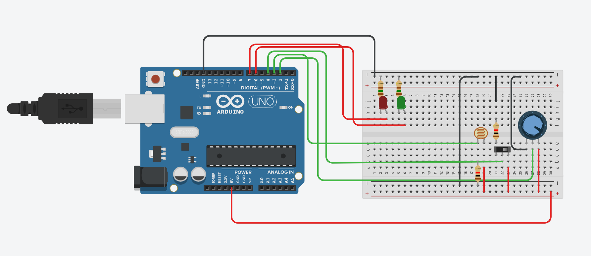

### Introduction
To correctly input password, you need to follow these steps in order: first, turn the potentiometer to the right, then open the switch to the left, followed by shining a flashlight on the photoresistor. Turn off the flashlight, then turn off the switch, and finally turn the potentiometer to the left. At this point, the blue light turns off, and the green light turns on.

### Circuit Diagram
I use some resistor 10Ω instead of wires because I didn't have enough wires(also I changed press button into swift one because of I can not find it). And if I monitor and check every state, it would be too complex for me to input the password. So I just reserve some little space for error. 
